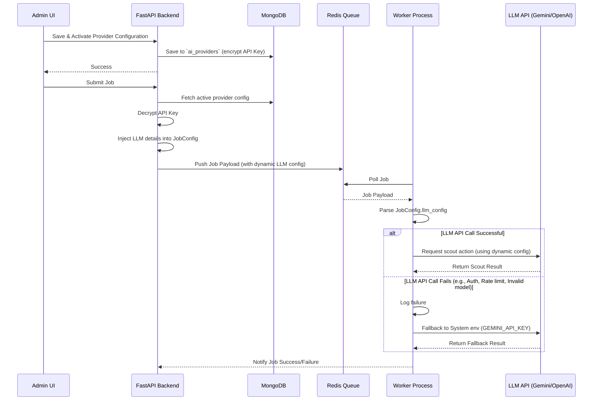

# PRD: Dynamic LLM Model and Provider Configuration Management

## 1. Introduction & Objectives

WebReel uses AI agents (via `browser-use` in Phase 1: Scout) to explore web pages and extract actions and narration scripts. Currently, LLM providers (Gemini and 9Router) are configured via static environment variables (`GEMINI_MODEL`, `ROUTER_API_KEY`, etc.) inside the worker environments or `.env` files.

This static approach is fragile: if a model is deprecated, if the API endpoint or keys change, or if a provider undergoes instability, the workers fail. Restating the compose services is required to update configurations.

**Objectives:**

- Establish a database-driven configuration system in MongoDB for LLM providers.
- Develop an Admin UI to add, update, delete, test, and activate LLM configurations.
- Update the job submission flow in the FastAPI backend to package the active LLM configuration into the job payload.
- Update workers to retrieve LLM configurations dynamically from the job payload at runtime.
- Implement an automatic fallback to system-configured Gemini environment variables in case the dynamic LLM configuration fails.

---

## 2. Technical Architecture & Data Flow

### 2.1 Database Schema (MongoDB)

A new collection `ai_providers` will be introduced to store provider configurations.

```json
{
  "_id": "ObjectId",
  "name": "Gemini / 9Router / Custom OpenAI",
  "provider_type": "gemini | openai_compatible",
  "base_url": "https://generativelanguage.googleapis.com/v1beta/openai | http://localhost:20128/v1 | ...",
  "api_key": "encrypted_api_key_string",
  "active_model": "gemini-3.1-flash-lite | kr/claude-sonnet-4.5 | ...",
  "available_models": ["gemini-3.1-flash-lite", "gemini-2.5-pro", "kr/claude-sonnet-4.5"],
  "is_active": true,
  "created_at": "ISODate",
  "updated_at": "ISODate"
}
```

_Note: Only one provider configuration can have `is_active: true` at any given time. Setting a provider as active automatically deactivates the previously active one._

### 2.2 API Key Protection

- **Storage Encryption:** API keys will be encrypted before saving to MongoDB using a simple symmetric key derived from a system secret (e.g., `SECRET_KEY` or `MONGO_PASSWORD`).
- **UI Masking:** In the Admin UI, the API key will be partially masked (e.g. `AIzaSy...xxxx` or `sk-pr...xxxx`) and never returned in full to the client in standard listing APIs.

### 2.3 Data Flow

The sequence diagram below visualizes the dynamic configuration flow:



---

## 3. Detailed Features

### 3.1 Backend FastAPI Endpoints

New endpoints added to `/api/admin/ai-settings`:

- `GET /api/admin/ai-settings/providers` - List all providers (API keys masked).
- `POST /api/admin/ai-settings/providers` - Create a provider configuration.
- `PUT /api/admin/ai-settings/providers/{id}` - Update a provider configuration.
- `DELETE /api/admin/ai-settings/providers/{id}` - Delete a provider.
- `POST /api/admin/ai-settings/providers/{id}/activate` - Set a provider as active.
- `POST /api/admin/ai-settings/test-connection` - Test connection to a provider and model:
  - Takes `provider_type`, `base_url`, `api_key`, and `model` as input.
  - Sends a simple completion request (`"Hello"`) to verify connectivity.
  - Sends a small 1x1 image payload to check if the model supports **Vision** (required for `browser-use`).

### 3.2 Frontend Admin Settings Page

A new route `/admin/settings` (accessible via "Cấu hình AI" in the Sidebar) containing:

1. **Provider List:** Table showing configured providers, active state, provider type, active model, and creation date.
2. **Add/Edit Form:** Modal/Form to manage providers:
   - Select Provider Type (`gemini` or `openai_compatible`).
   - Enter Endpoint (Base URL).
   - Enter API Key (masked when editing).
   - Add/Select Model names.
3. **Test Connection Utility:** A button inside the Add/Edit form to validate the configuration immediately:
   - Returns validation status (Connection successful/failed).
   - Returns vision capability status (Vision supported: Yes/No).
4. **Activation Switch:** Quick toggle to activate a provider.

### 3.3 Worker Runtime Integration

- Update `JobConfig` schema to support `llm_config` containing:
  - `provider_type`
  - `base_url`
  - `api_key`
  - `model`
- Update `desktop_app/pipeline.py` (and relevant workers):
  - Prioritize `llm_config` parameters inside `run_pipeline_v3` for LLM initialization.
  - Wrap scout LLM calls in a try-except block.
  - If a dynamic LLM initialization or execution fails, log warning and automatically fall back to standard Gemini initialization using `os.getenv("GEMINI_API_KEY")` and `os.getenv("GEMINI_MODEL")`.

---

## 4. Key Security & Resilience Measures

- **Graceful Degradation:** If the MongoDB collection is empty or cannot be reached at job submission, the backend will default to transmitting empty LLM parameters, triggering the worker to fall back directly to environment variables.
- **API Key Safety:** Keys are decrypted only at job dispatching or connection testing and are never exposed in UI fetch requests.
